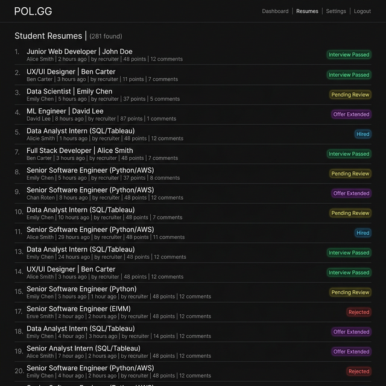
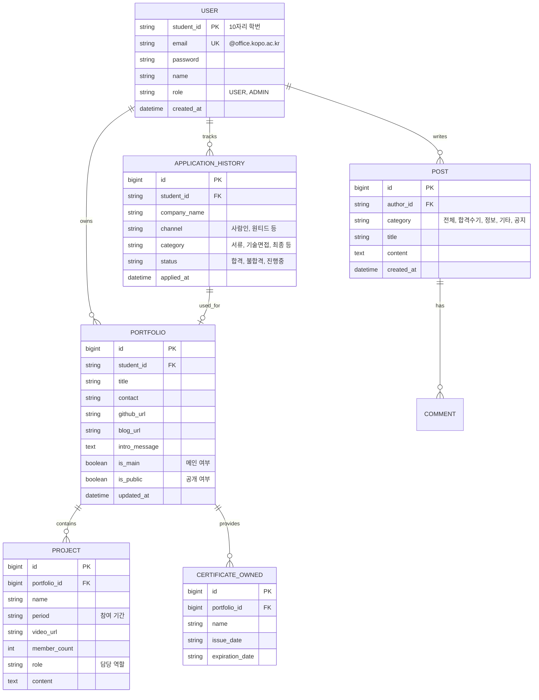
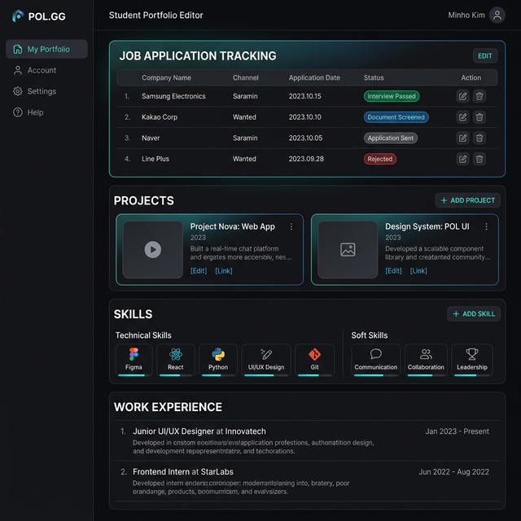

# 🚀 POL.GG - 폴리텍 AI융합소프트웨어과 통합 포트폴리오 관리 플랫폼

## 📌 프로젝트 개요
'POL.GG'는 한국폴리텍대학교 학생들이 자신의 학업 결과물과 커리어를 체계적으로 관리하고 공유할 수 있는 **포트폴리오 대시보드 및 커뮤니티 서비스**입니다. 최신 AI 기술(LLM, RAG)을 접목하여 데이터 기반의 취업 상담 및 정보를 제공합니다.

---

## 🛠 기술 스택 (Tech Stack)

| 구분 | 기술 | 상세 |
| :--- | :--- | :--- |
| **Frontend** | React, CSS, Vite | 사용자 경험 중심의 반응형 웹 |
| **Backend** | Spring Boot, JPA, Security | 안정적인 비즈니스 로직 및 보안 |
| **Database** | MySQL, Redis | 정형 데이터 및 캐싱 관리 |
| **AI** | LangChain, GPT-4o, VectorDB | 포트폴리오 기반 지능형 챗봇 |
| **DevOps** | GitHub Actions, AWS | 자동화된 배포 및 인프라 |

---

## 🏗 ERD (Entity Relationship Diagram)

---

## 🎨 UI 목업 (UI Mockups)

### 1. 메인 대시보드 (Main Dashboard)
- Hacker News 스타일의 미니멀한 텍스트 리스트 구성.
- 사진을 배제하고 제목, 작성자, 등록 시간, 합불 상태(Tag) 등 핵심 정보만 간결하게 노출.
- 세련된 다크 모드와 고대비 타이포그래피로 전문성 강조.

### 2. 마이페이지 / 포트폴리오 에디터 (My Page & Editor)
- 프로젝트 등록, 기술 스택 관리, 지원 현황 추적 기능 제공.

---

## 📅 주요 기능 및 API 요약

- **인증**: 학교 이메일(@office.kopo.ac.kr) 기반 학번 연동 가입.
- **포트폴리오**: 메인/기타 포트폴리오 관리, 프로젝트 시연 영상 및 내용 기재.
- **지원 현황**: 본인의 지원 내역(채널, 전형 단계, 결과) 관리 기능.
- **자격증 커뮤니티**: 카테고리별 자격증 정보 공유 및 공지사항 게시판.
- **AI 챗봇**: RAG 기반의 지능형 취업 정보 상담 서비스.

더 자세한 내용은 [docs/api_spec.md](docs/api_spec.md)를 참고하세요.

---

## 📅 개발 계획 (Schedule)

| 주차 | 단계 | 주요 목표 |
| :--- | :--- | :--- |
| 1-4주 | 설계 및 환경 구축 | ERD, API 설계, 인프라 셋업 |
| 5-11주 | 기능 개발 | 코어 기능 (인증, 포트폴리오, 게시판) |
| 12-14주 | AI 고도화 | RAG 및 LLM 챗봇 개발 |
| 15-16주 | 마무리 | 테스트, 버그 수정 및 최종 발표 |

자세한 내용은 [docs/schedule.md](docs/schedule.md)를 참고하세요.

---

## 👨‍💻 팀 구성원
- **Developer A**: 팀장 / 아키텍처 / 인증
- **Developer B**: 백엔드 / AI 엔진
- **Developer C**: 프론트엔드 / UI/UX
- **Developer D**: 프론트엔드 / 게시판 / QA
