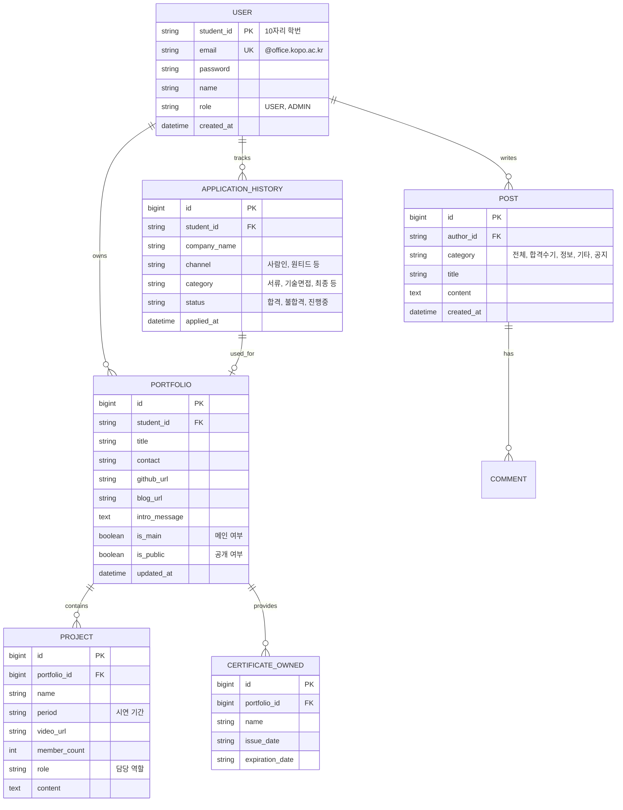

# ERD (Entity Relationship Diagram)

```mermaid
erDiagram
    USER ||--o{ PORTFOLIO : owns
    USER ||--o{ APPLICATION_HISTORY : tracks
    USER ||--o{ POST : writes
    PORTFOLIO ||--o{ PROJECT : contains
    PORTFOLIO ||--o{ CERTIFICATE_OWNED : provides
    APPLICATION_HISTORY ||--o| PORTFOLIO : used_for
    POST ||--o{ COMMENT : has

    USER {
        string student_id PK "10자리 학번"
        string email UK "@office.kopo.ac.kr"
        string password
        string name
        string role "USER, ADMIN"
        datetime created_at
    }

    PORTFOLIO {
        bigint id PK
        string student_id FK
        string title
        string contact
        string github_url
        string blog_url
        text intro_message
        boolean is_main "메인 여부"
        boolean is_public "공개 여부"
        datetime updated_at
    }

    PROJECT {
        bigint id PK
        bigint portfolio_id FK
        string name
        string period "시연 기간"
        string video_url
        int member_count
        string role "담당 역할"
        text content
    }

    APPLICATION_HISTORY {
        bigint id PK
        string student_id FK
        string company_name
        string channel "사람인, 원티드 등"
        string category "서류, 기술면접, 최종 등"
        string status "합격, 불합격, 진행중"
        datetime applied_at
    }

    POST {
        bigint id PK
        string author_id FK
        string category "전체, 합격수기, 정보, 기타, 공지"
        string title
        text content
        datetime created_at
    }

    CERTIFICATE_OWNED {
        bigint id PK
        bigint portfolio_id FK
        string name
        string issue_date
        string expiration_date
    }
```
